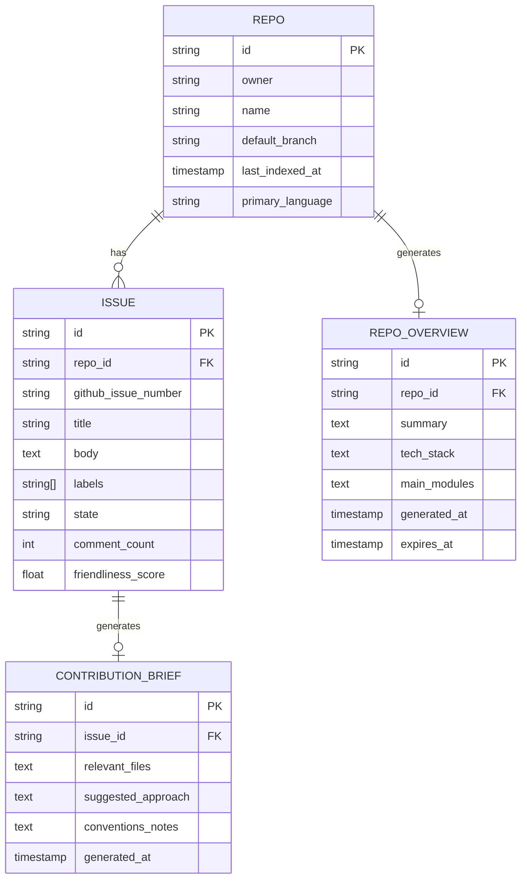

# MVP spec — OSS repo onboarding copilot

Status: draft for review
Owner: (you)
Last updated: 2026-09-05

## 1. Problem statement

New contributors to open-source projects lose momentum before their first PR because they can't quickly understand an unfamiliar codebase or figure out what a specific issue actually requires. Existing tools (DeepWiki, Greptile, etc.) explain code in general, but none are built around the specific job of "help me go from zero to a shipped PR on this repo."

## 2. Goals (v1)

- Let a newcomer paste a repo URL and get a fast, useful overview of what it does and how it's organized.
- Surface approachable open issues for that repo, ranked by how "first-timer friendly" they look.
- Let a newcomer paste a specific issue URL and get a contribution brief: relevant files, what likely needs to change, and repo conventions to follow.
- Keep the system cheap to run per-repo so it's viable as a side project.

## 3. Non-goals (v1)

Explicitly out of scope for this version:

- Private repository support (public GitHub repos only).
- Automatic PR generation or code writing — the tool explains and points, it does not write the fix.
- Full semantic code graph / call-graph indexing (deferred to a later version if the contribution brief proves too shallow without it).
- Multi-turn open-ended chat Q&A about the repo (deferred — v1 output is structured briefs, not a chat interface).
- Support for GitLab, Bitbucket, or other non-GitHub hosts.
- Maintainer-facing features: analytics dashboards, custom onboarding flows, webhooks/re-indexing on commit.
- User accounts, saved history, or personalization across sessions.
- Non-English repositories/issues (best-effort only, not a supported use case).
- Mobile app or browser extension — web app only.

## 4. Core user flows (user stories)

**US-1: Repo overview (cold start)**
As a newcomer who just found an interesting repo, I want to paste its URL and get a short summary of what it does, its tech stack, and its main modules, so I can decide if I want to contribute without reading the whole codebase first.

**US-2: Good-first-issue discovery**
As a newcomer who understands the repo at a high level, I want to see a ranked list of approachable open issues, so I don't have to manually dig through the issue tracker to find something I could realistically tackle.

**US-3: Contribution brief from an issue**
As a newcomer who has picked (or been given) a specific issue, I want to paste its URL and get back the likely relevant files, a plain-language explanation of what needs to change, and any conventions I should follow, so I can start coding with confidence instead of guessing.

**US-4: Repo conventions lookup**
As a newcomer preparing to open a PR, I want the tool to surface the repo's contribution rules (branch naming, test requirements, lint rules, PR template) pulled from CONTRIBUTING.md and similar files, so my PR isn't rejected for avoidable formatting/process reasons.

**US-5: Maintainer discoverability (lightweight)**
As a maintainer, I want a simple badge/link I can add to my README pointing to this tool for my repo, so new contributors have an easier on-ramp without me spending time answering the same onboarding questions repeatedly.

## 5. Data model

Entities and relationships for v1. Kept intentionally shallow — no full code graph.

Notes:

- `REPO_OVERVIEW` and `CONTRIBUTION_BRIEF` are cached, regenerable artifacts, not source-of-truth data — they can be deleted and rebuilt from `REPO`/`ISSUE` at any time.
- `friendliness_score` on `ISSUE` is a simple heuristic score (label match, age, comment count, "claimed" status) computed at fetch time, not stored long-term truth.
- No `USER` entity in v1 — the tool is stateless per visit (see non-goals).

## 6. Tech decisions

| Area             | Decision                                                                                                                                              | Reasoning                                                                                                                                                                                                                                                                                                                      |
| ---------------- | ----------------------------------------------------------------------------------------------------------------------------------------------------- | ------------------------------------------------------------------------------------------------------------------------------------------------------------------------------------------------------------------------------------------------------------------------------------------------------------------------------ |
| Auth             | None for end users in v1; server-side GitHub App/PAT for API calls                                                                                    | End users only paste public URLs — no login needed to use the tool, which lowers friction for the target audience. A single server-side GitHub token avoids per-user OAuth complexity while still getting higher API rate limits than unauthenticated calls.                                                                   |
| Real-time        | Not needed in v1 — synchronous request/response with a loading state                                                                                  | Repo overview and contribution brief generation take a few seconds (LLM calls + GitHub API), which is fine as a blocking request. No live collaboration or streaming updates are in scope, so WebSockets/pub-sub would be unjustified complexity.                                                                              |
| Storage          | Lightweight relational DB (e.g. Postgres via Supabase) for cached `REPO_OVERVIEW` and `CONTRIBUTION_BRIEF`; no raw code storage                       | Caching avoids re-running expensive LLM generation for popular repos, cutting cost. Storing only generated artifacts (not cloned repo contents) keeps storage cheap and avoids the complexity/legal surface of hosting third-party source code.                                                                                |
| Third-party APIs | GitHub REST API (repo metadata, file tree, issues) + an LLM API (e.g. Anthropic API) for summarization                                                | GitHub API is the only way to get repo/issue data without cloning; using its file-tree and content endpoints avoids a full `git clone` for v1. One LLM provider is used for both repo summaries and contribution briefs to keep integration and cost simple, with room to swap providers per-task later if quality demands it. |
| Indexing depth   | File tree + README + manifest files (package.json, requirements.txt, etc.) + issue text only — no AST parsing or call graph                           | Matches the non-goal of skipping full semantic indexing in v1. This data is enough to produce a useful overview and a first-pass contribution brief, and is dramatically cheaper to compute than a code graph.                                                                                                                 |
| Caching policy   | Repo overviews cached with a TTL (e.g. 7 days) and manual re-generate option; contribution briefs generated fresh per issue (not cached across users) | Repo structure changes slowly, so a short-lived cache keeps overviews fast and cheap for popular repos. Issues are unique per request and briefs are cheap enough to generate fresh, so no caching complexity is needed there yet.                                                                                             |

## 7. Open questions (to resolve before/at spec review)

- Should the "friendliness score" for issues be a fully deterministic heuristic (labels/age/comments) or LLM-assisted in v1? Deterministic is cheaper and more predictable — default to that unless testing shows it's not good enough.
- What's the fallback behavior when a repo has no README/CONTRIBUTING.md or very sparse docs? The overview quality depends heavily on this.
- Rate limiting: how do we prevent abuse (e.g. someone scripting requests against many repos) without requiring login?
- Do we pre-generate overviews for a curated list of popular repos at launch to seed initial content, or only generate on first visit?

## 8. Gate — review checklist

- [ ] 3–5 core user flows written as user stories — done, see Section 4
- [ ] Data model / entity diagram sketched — done, see Section 5
- [ ] Tech decisions logged (auth, real-time, storage, third-party APIs) with reasons — done, see Section 6
- [ ] Explicit non-goals listed (what's NOT in v1) — done, see Section 3
- [ ] MVP spec doc finalized (`/docs/spec.md`)
- [ ] Gate: spec reviewed once more — anything cuttable?
